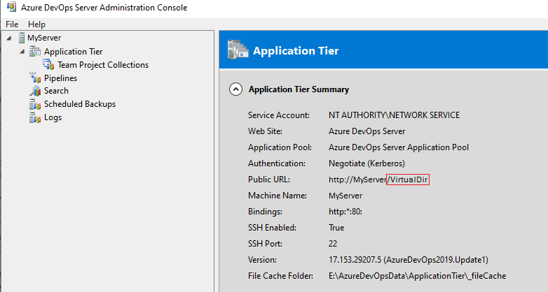
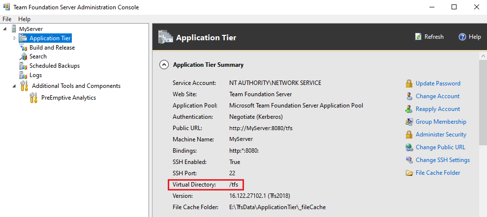

# Virtual Directory

Any version of the server can be configured to use Virtual Directory. By default, Azure DevOps Server 2019 uses empty Virtual Directory (`VirtualDirectory="/"`) while previous versions of the server used `/tfs` as the default.

To find out the value of Virtual Directory for your server check the server configuration as follows:

## Azure DevOps Server 2019 or later

Open _Azure DevOps Server Administration Console_ from start menu and navigate to _Application Tier_. The Virtual Directory is displayed in _Application Tier Summary_ under _Public URL_. It's the part of the URL that follows the server domain ("/VirtualDir" in the example below):

## Team Foundation Server 2018 or earlier

Open _Team Foundation Server Administration Console_ from start menu and navigate to _Application Tier_. The Virtual Directory is listed in the _Application Tier Summary_:

